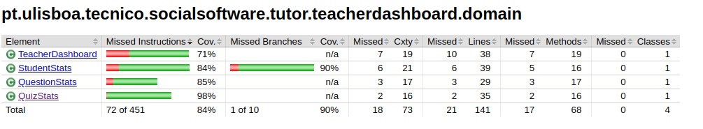

# ES P1 submission, Group 23

## Feature ESA

### Subgroup
 - Filipa Magalhaes, 99216, [GitLab link](https://gitlab.rnl.tecnico.ulisboa.pt/ist199216)
   + Issues assigned: [#1](https://gitlab.rnl.tecnico.ulisboa.pt/es/es23-23/-/issues/1), [#2](https://gitlab.rnl.tecnico.ulisboa.pt/es/es23-23/-/issues/2), [#3](https://gitlab.rnl.tecnico.ulisboa.pt/es/es23-23/-/issues/3), [#18](https://gitlab.rnl.tecnico.ulisboa.pt/es/es23-23/-/issues/18), [#19](https://gitlab.rnl.tecnico.ulisboa.pt/es/es23-23/-/issues/19), [#31](https://gitlab.rnl.tecnico.ulisboa.pt/es/es23-23/-/issues/31), [#21](https://gitlab.rnl.tecnico.ulisboa.pt/es/es23-23/-/issues/21), [#22](https://gitlab.rnl.tecnico.ulisboa.pt/es/es23-23/-/issues/22)
 - Valentim Santos, 99343, [GitLab link](https://gitlab.rnl.tecnico.ulisboa.pt/ist199343)
   + Issues assigned: [#1](https://gitlab.rnl.tecnico.ulisboa.pt/es/es23-23/-/issues/1), [#2](https://gitlab.rnl.tecnico.ulisboa.pt/es/es23-23/-/issues/2), [#3](https://gitlab.rnl.tecnico.ulisboa.pt/es/es23-23/-/issues/3), [#17](https://gitlab.rnl.tecnico.ulisboa.pt/es/es23-23/-/issues/17), [#18](https://gitlab.rnl.tecnico.ulisboa.pt/es/es23-23/-/issues/18), [#31](https://gitlab.rnl.tecnico.ulisboa.pt/es/es23-23/-/issues/31), [#20](https://gitlab.rnl.tecnico.ulisboa.pt/es/es23-23/-/issues/20), [#23](https://gitlab.rnl.tecnico.ulisboa.pt/es/es23-23/-/issues/23)
 
### Merge requests associated with this feature

The list of pull requests associated with this feature is:

 - [MR #1](https://gitlab.rnl.tecnico.ulisboa.pt/es/es23-23/-/merge_requests/1)
 - [MR #4](https://gitlab.rnl.tecnico.ulisboa.pt/es/es23-23/-/merge_requests/4)
 - [MR #6](https://gitlab.rnl.tecnico.ulisboa.pt/es/es23-23/-/merge_requests/6)

### Test Coverage Screenshots

The screenshot includes the test coverage results associated with the new/changed entities:

---

## Feature ESQ

### Subgroup
 - Lucas Barbosa, 99264, [GitLab link](https://gitlab.rnl.tecnico.ulisboa.pt/ist199264)
   + Issues assigned: [#4](https://gitlab.rnl.tecnico.ulisboa.pt/es/es23-23/-/issues/4), [#5](https://gitlab.rnl.tecnico.ulisboa.pt/es/es23-23/-/issues/5), [#6](https://gitlab.rnl.tecnico.ulisboa.pt/es/es23-23/-/issues/6), [#10](https://gitlab.rnl.tecnico.ulisboa.pt/es/es23-23/-/issues/10), [#14](https://gitlab.rnl.tecnico.ulisboa.pt/es/es23-23/-/issues/14), [#13](https://gitlab.rnl.tecnico.ulisboa.pt/es/es23-23/-/issues/13), [#16](https://gitlab.rnl.tecnico.ulisboa.pt/es/es23-23/-/issues/16)
 - Renato Martins, 102314, [GitLab link](https://gitlab.rnl.tecnico.ulisboa.pt/ist1102314)
   + Issues assigned: [#4](https://gitlab.rnl.tecnico.ulisboa.pt/es/es23-23/-/issues/4), [#5](https://gitlab.rnl.tecnico.ulisboa.pt/es/es23-23/-/issues/5), [#6](https://gitlab.rnl.tecnico.ulisboa.pt/es/es23-23/-/issues/6), [#11](https://gitlab.rnl.tecnico.ulisboa.pt/es/es23-23/-/issues/11), [#14](https://gitlab.rnl.tecnico.ulisboa.pt/es/es23-23/-/issues/14), [#12](https://gitlab.rnl.tecnico.ulisboa.pt/es/es23-23/-/issues/12), [#15](https://gitlab.rnl.tecnico.ulisboa.pt/es/es23-23/-/issues/15)
 
### Merge requests associated with this feature

The list of pull requests associated with this feature is:

 - [MR #3](https://gitlab.rnl.tecnico.ulisboa.pt/es/es23-23/-/merge_requests/3)
 - [MR #2](https://gitlab.rnl.tecnico.ulisboa.pt/es/es23-23/-/merge_requests/7)
 - [MR #3](https://gitlab.rnl.tecnico.ulisboa.pt/es/es23-23/-/merge_requests/9)

### Test Coverage Screenshots

The screenshot includes the test coverage results associated with the new/changed entities:

---

## Feature ESP

### Subgroup
 - Pedro Rodrigues, 99300, [GitLab link](https://gitlab.rnl.tecnico.ulisboa.pt/ist199300)
   + Issues assigned: [#7](https://gitlab.rnl.tecnico.ulisboa.pt/es/es23-23/-/issues/7), [#8](https://gitlab.rnl.tecnico.ulisboa.pt/es/es23-23/-/issues/8), [#9](https://gitlab.rnl.tecnico.ulisboa.pt/es/es23-23/-/issues/9), [#32](https://gitlab.rnl.tecnico.ulisboa.pt/es/es23-23/-/issues/32), [#26](https://gitlab.rnl.tecnico.ulisboa.pt/es/es23-23/-/issues/26), [#28](https://gitlab.rnl.tecnico.ulisboa.pt/es/es23-23/-/issues/28), [#30](https://gitlab.rnl.tecnico.ulisboa.pt/es/es23-23/-/issues/30)
 - Tomas Marques, 99340, [GitLab link](https://gitlab.rnl.tecnico.ulisboa.pt/ist199340)
   + Issues assigned: [#7](https://gitlab.rnl.tecnico.ulisboa.pt/es/es23-23/-/issues/7), [#8](https://gitlab.rnl.tecnico.ulisboa.pt/es/es23-23/-/issues/8), [#9](https://gitlab.rnl.tecnico.ulisboa.pt/es/es23-23/-/issues/9), [#25](https://gitlab.rnl.tecnico.ulisboa.pt/es/es23-23/-/issues/25), [#26](https://gitlab.rnl.tecnico.ulisboa.pt/es/es23-23/-/issues/26), [#24](https://gitlab.rnl.tecnico.ulisboa.pt/es/es23-23/-/issues/24), [#27](https://gitlab.rnl.tecnico.ulisboa.pt/es/es23-23/-/issues/27), [#29](https://gitlab.rnl.tecnico.ulisboa.pt/es/es23-23/-/issues/29)
### Merge requests associated with this feature

The list of pull requests associated with this feature is:

 - [MR #2](https://gitlab.rnl.tecnico.ulisboa.pt/es/es23-23/-/merge_requests/2)
 - [MR #2](https://gitlab.rnl.tecnico.ulisboa.pt/es/es23-23/-/merge_requests/5)
 - [MR #3](https://gitlab.rnl.tecnico.ulisboa.pt/es/es23-23/-/merge_requests/8)

### Test Coverage Screenshots

The screenshot includes the test coverage results associated with the new/changed entities:

---