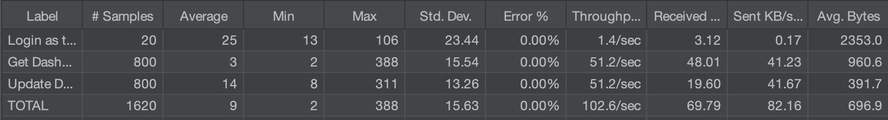
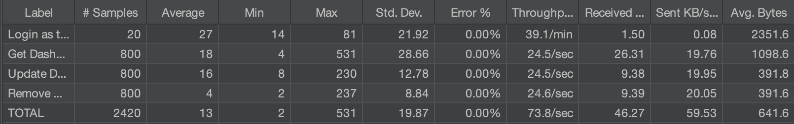

# ES P3 submission, Group 23

## Did your group use the base code provided?

Yes

## Feature ESA

### Subgroup
 - Filipa Magalhaes, 99216, [GitLab link](https://gitlab.rnl.tecnico.ulisboa.pt/ist199216)
   + Issues assigned: [#66](https://gitlab.rnl.tecnico.ulisboa.pt/es/es23-23/-/issues/66), [#67](https://gitlab.rnl.tecnico.ulisboa.pt/es/es23-23/-/issues/67), [#68](https://gitlab.rnl.tecnico.ulisboa.pt/es/es23-23/-/issues/68), [#76](https://gitlab.rnl.tecnico.ulisboa.pt/es/es23-23/-/issues/76), [#83](https://gitlab.rnl.tecnico.ulisboa.pt/es/es23-23/-/issues/83), [#69](https://gitlab.rnl.tecnico.ulisboa.pt/es/es23-23/-/issues/69), [#82](https://gitlab.rnl.tecnico.ulisboa.pt/es/es23-23/-/issues/82), [#83](https://gitlab.rnl.tecnico.ulisboa.pt/es/es23-23/-/issues/83)
 - Valentim Santos, 99343, [GitLab link](https://gitlab.rnl.tecnico.ulisboa.pt/ist199343)
   + Issues assigned: [#66](https://gitlab.rnl.tecnico.ulisboa.pt/es/es23-23/-/issues/66), [#67](https://gitlab.rnl.tecnico.ulisboa.pt/es/es23-23/-/issues/67), [#68](https://gitlab.rnl.tecnico.ulisboa.pt/es/es23-23/-/issues/68), [#74](https://gitlab.rnl.tecnico.ulisboa.pt/es/es23-23/-/issues/74), [#69](https://gitlab.rnl.tecnico.ulisboa.pt/es/es23-23/-/issues/69), [#82](https://gitlab.rnl.tecnico.ulisboa.pt/es/es23-23/-/issues/82)
 
### Merge requests associated with this feature

The list of pull requests associated with this feature is:

 - [MR #20](https://gitlab.rnl.tecnico.ulisboa.pt/es/es23-23/-/merge_requests/20)

### JMeter Load test

  - JMeter test: get
  

### Cypress end-to-end tests

- Data initialization:
  The data was initialized in the backend (DemoService.java file). The three desired course executions were created and for each one of them a different set of students, quizzes and questions was created, in order to have distinct stats in each execution.

- [Cypress test 1](https://gitlab.rnl.tecnico.ulisboa.pt/es/es23-23/-/blob/end_to_end_tests_implementation/frontend/tests/e2e/specs/teacherDashboard/teacherDashboard.js)

---

## Feature ESQ

### Subgroup
 - Lucas Barbosa, 99264, [GitLab link](https://gitlab.rnl.tecnico.ulisboa.pt/ist199264)
   + Issues assigned: [#66](https://gitlab.rnl.tecnico.ulisboa.pt/es/es23-23/-/issues/66), [#67](https://gitlab.rnl.tecnico.ulisboa.pt/es/es23-23/-/issues/67), [#68](https://gitlab.rnl.tecnico.ulisboa.pt/es/es23-23/-/issues/68), [#85](https://gitlab.rnl.tecnico.ulisboa.pt/es/es23-23/-/issues/85), [#80](https://gitlab.rnl.tecnico.ulisboa.pt/es/es23-23/-/issues/80), [#81](https://gitlab.rnl.tecnico.ulisboa.pt/es/es23-23/-/issues/81)
 - Renato Martins, 102314, [GitLab link](https://gitlab.rnl.tecnico.ulisboa.pt/ist1102314)
   + Issues assigned: [#66](https://gitlab.rnl.tecnico.ulisboa.pt/es/es23-23/-/issues/66), [#67](https://gitlab.rnl.tecnico.ulisboa.pt/es/es23-23/-/issues/67), [#68](https://gitlab.rnl.tecnico.ulisboa.pt/es/es23-23/-/issues/68), [#78](https://gitlab.rnl.tecnico.ulisboa.pt/es/es23-23/-/issues/78), [#80](https://gitlab.rnl.tecnico.ulisboa.pt/es/es23-23/-/issues/80), [#81](https://gitlab.rnl.tecnico.ulisboa.pt/es/es23-23/-/issues/81)
 
### Merge requests associated with this feature

The list of pull requests associated with this feature is:

 - [MR #21](https://gitlab.rnl.tecnico.ulisboa.pt/es/es23-23/-/merge_requests/21)

### JMeter Load test

  - JMeter test: update
  

### Cypress end-to-end tests

- Data initialization:
  The data was initialized in the backend (DemoService.java file). The three desired course executions were created and for each one of them a different set of students, quizzes and questions was created, in order to have distinct stats in each execution.

- [Cypress test 2](https://gitlab.rnl.tecnico.ulisboa.pt/es/es23-23/-/blob/end_to_end_tests_implementation/frontend/tests/e2e/specs/teacherDashboard/teacherDashboard.js)

---

## Feature ESP

### Subgroup
 - Pedro Rodrigues, 99300, [GitLab link](https://gitlab.rnl.tecnico.ulisboa.pt/ist199300)
   + Issues assigned: [#66](https://gitlab.rnl.tecnico.ulisboa.pt/es/es23-23/-/issues/66), [#67](https://gitlab.rnl.tecnico.ulisboa.pt/es/es23-23/-/issues/67), [#68](https://gitlab.rnl.tecnico.ulisboa.pt/es/es23-23/-/issues/68), [#77](https://gitlab.rnl.tecnico.ulisboa.pt/es/es23-23/-/issues/77), [#70](https://gitlab.rnl.tecnico.ulisboa.pt/es/es23-23/-/issues/70), [#79](https://gitlab.rnl.tecnico.ulisboa.pt/es/es23-23/-/issues/79)
 - Tomas Marques, 99340, [GitLab link](https://gitlab.rnl.tecnico.ulisboa.pt/ist199340)
   + Issues assigned: [#66](https://gitlab.rnl.tecnico.ulisboa.pt/es/es23-23/-/issues/66), [#67](https://gitlab.rnl.tecnico.ulisboa.pt/es/es23-23/-/issues/67), [#68](https://gitlab.rnl.tecnico.ulisboa.pt/es/es23-23/-/issues/68), [#84](https://gitlab.rnl.tecnico.ulisboa.pt/es/es23-23/-/issues/84), [#77](https://gitlab.rnl.tecnico.ulisboa.pt/es/es23-23/-/issues/77), [#70](https://gitlab.rnl.tecnico.ulisboa.pt/es/es23-23/-/issues/70), [#79](https://gitlab.rnl.tecnico.ulisboa.pt/es/es23-23/-/issues/79)
 
### Merge requests associated with this feature

The list of pull requests associated with this feature is:

 - [MR #22](https://gitlab.rnl.tecnico.ulisboa.pt/es/es23-23/-/merge_requests/22)

### JMeter Load test

  - JMeter test: create → remove
  

### Cypress end-to-end tests

- Data initialization:
  The data was initialized in the backend (DemoService.java file). The three desired course executions were created and for each one of them a different set of students, quizzes and questions was created, in order to have distinct stats in each execution.

- [Cypress test 3](https://gitlab.rnl.tecnico.ulisboa.pt/es/es23-23/-/blob/end_to_end_tests_implementation/frontend/tests/e2e/specs/teacherDashboard/teacherDashboard.js)

---